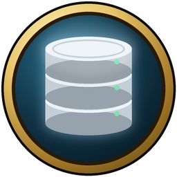

<p align="center"></p>

# mod-lonelyice-mysql

MySQL 8 for a server built without it: the server keeps its databases on a MySQL server, on the same machine or
another one, instead of the built-in (SQLite) files.

## Use with LonelyIce

Install the plugin from the catalog, then open Maintenance → Server data, fill in the MySQL server, user,
password and database prefix, and choose "Use MySQL". LonelyIce creates the databases that are missing there
(`<prefix>auth`, `<prefix>characters`, `<prefix>world`, `<prefix>playerbots`; the user needs the right to create
databases), brings existing ones up to date and unpacks the client's tables into the world database. The
built-in databases stay as they are; "Back to built-in" returns to them.

## What it is

The MySQL backend of [LonelyIceProject/azerothcore-wotlk](https://github.com/LonelyIceProject/azerothcore-wotlk)
compiled as a plugin: its library registers the `mysql` database backend while the scripts load, before the
databases are opened, so `mysql:` connection strings work in a core built with `-DWITH_MYSQL=OFF`. The MySQL
client library and the `mysql` program (the core applies SQL files with it, see `MySQLExecutable`) are shipped
next to the plugin library.

## Build

With the core built as shared libraries (`-DWITH_DYNAMIC_LINKING=ON`) and this folder in `AC_PLUGIN_SOURCE_DIRS`,
point `LONELYICE_MYSQL_DIR` at a MySQL 8 distribution (`include/`, `lib/`, `bin/`):

```
cmake -S . -B build -DLONELYICE_MYSQL_DIR=C:/mysql-8.4
cmake --build build --target mod-lonelyice-mysql
```

Without it the plugin is skipped.

## License

GPL-2.0-or-later, see [LICENSE](LICENSE). MySQL client components are GPL-2.0 (Oracle's FOSS exception applies).
